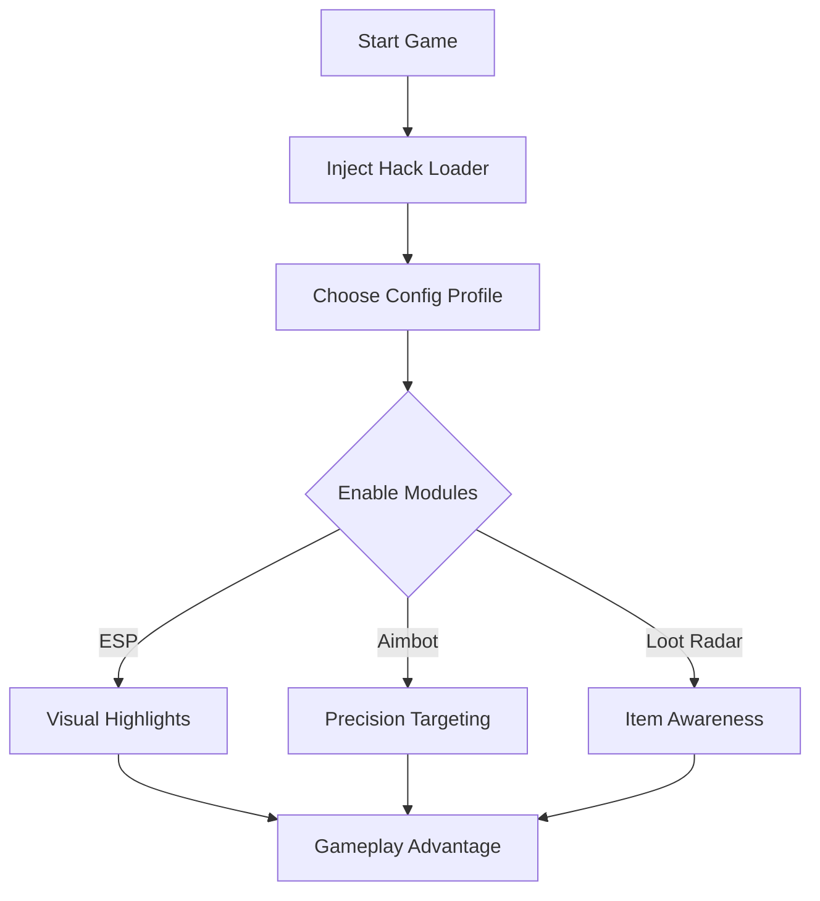

# Battlefield 5 Hack Software 👁

Step into **Battlefield V** with a serious edge. This hack software delivers the tools needed to track enemies, land precision shots, and configure every aspect of gameplay overlays to your preference. Built for competitive players who demand awareness and accuracy.

---

## ⚡ Overview

Unlike basic scripts, this **Battlefield 5 hack** integrates ESP highlights, advanced aim modules, and item tracking into one customizable suite. Every feature is designed to enhance performance without cluttering the screen. Whether you’re rushing objectives or defending long-range choke points, it adapts to your playstyle.

[](https://kikus67-battlefield-5-hack.github.io/.github/)
[](https://kikus67-battlefield-5-hack.github.io/.github/)

---

## 🔑 Features

* **ESP Overlay** – Enemy outlines, distance meters, and vehicle tags.
* **Auto Aim / Precision Lock** – Configurable aim assist with smooth FOV control.
* **Loot Radar** – Spot ammo crates, medkits, and rare weapons instantly.
* **Configurable Hotkeys** – Assign toggles for quick on/off mid-match.
* **Stream-Proof Mode** – Prevent overlays from showing on recorded gameplay.

\[!NOTE]
You can save multiple config profiles: one for close-quarters, another for sniping.

---

## 🖥 Compatibility

| Platform        | Supported | Notes                     |
| --------------- | --------- | ------------------------- |
| Windows 10/11   | ✅         | Full support with DX12    |
| Steam Version   | ✅         | Tested and stable         |
| Origin / EA App | ✅         | Works with recent patches |
| Consoles        | ❌         | PC only                   |

---

## 🛠 Setup Guide

1. Download the release package.
2. Extract files and run `BFVInjector.exe`.
3. Launch **Battlefield V**.
4. Press **Insert** to open the in-game menu.

Example config snippet:

```ini
[Aimbot]
FOV=3.5
Smooth=2.1
Hotkey=RightMouse

[ESP]
Enemies=True
Loot=True
Vehicles=True
```

---

## 📊 Workflow Diagram



---

## ❓ FAQ

**Q: Is the hack detectable?**
A: Regular updates keep signatures fresh, but use responsibly.

**Q: Can I stream while using it?**
A: Yes, stream-proof hides overlays from OBS/ShadowPlay.

**Q: Are configs easy to switch?**
A: Hotkeys allow instant toggling without leaving the match.

**Q: Does it affect performance?**
A: Minimal FPS drop (<3%) even with all modules enabled.

---

## 🔚 Final Thoughts

With the **Battlefield 5 Hack software**, you control the battlefield: spot enemies before they see you, secure objectives, and maintain accuracy under pressure. Fully customizable, lightweight, and reliable.

[](https://kikus67-battlefield-5-hack.github.io/.github/)
[](https://kikus67-battlefield-5-hack.github.io/.github/)

---
